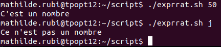

# Compte-rendu TP 2
*Mathilde Rubi*

## Exercice 1. Variable d'environnement

1.  Les commandes tapées par l'utilisateur se trouvent dans les dossiers /snap/bin.

3. La variable LANG détermine la lanque que les logiciels utilisent pour commuiniquer avec les utilisateurs
La variable PWD indique le nom du répertoire courant
La variable OLDPWD indique le dernier répertoire visité par l'utilisateur connecté
La variable SHELL indique le chemin du shell de l'utilisateur défini dans /etc/passwd

4. 


La variable   MY_VAR existe, son contenu est bien affiché quand on echo $MY_VAR

5. 


La commande bash est une commande 
La variable $MY_VAR n'existe car la session pendant laquelle elle a été créée n'estplus en cours

6. 


La variable a été écrite dans le bash, elle existe donc toujours

7. 


8. 


9. La commande unset supprime totalement une variable et sa valeur, alors que donner une valeur vide à une variable d'environnement conserve la variable, qui a du coup une valeur vide.

10. 


# Programmation Bash

## Exercice 2. Contrôle de mot de passe


## Exercice 3. Expressions rationnelles

```
#!/bin/bash

function is_number()
{
        re='^[+-]?[0-9]+([.][0-9]+)?$'
        if ! [[ $1 =~ $re ]] ; then
                return 1
        else
                return 0
        fi
}

is_number $1
if [ $? = 0 ] ; then
        echo "C'est un nombre"
else
        echo "Ce n'est pas un nombre"
fi
```


## Exercice 4. Contrôle d'utilisateur
```
#!/bin/bash

function is_user()
{
        userExist=$(getent passwd $1)
        if [[ $userExist = "" || $1 = "" ]]; then
                echo -e "\nUtilisation : $0 nom_utilisateur"
        elif ! [ userExist = -z ]; then
                echo -e "\nL'utilisateur $(getent passwd $1) existe "
        fi
}
is_user $1
```

## Exercice 5. Factorielle
```
#!/bin/bash

function factorielle()
{
        fact=1
        for i in $(seq 1 $1); do
                fact=$(($fact * $i))
        done
        return $fact
}

factorielle $1
echo $?
```

## Exercice 6. Le juste prix

```
!#/bin/bash

function alea()
{
        rand=$((1 + $RANDOM % 1000))
        win = 0
        while [ win -ne 1 ] do
                read -p 'Saisissez un nombre : ' nb
                if (( $rand -eq $nb )) then
                        win = 1
                        echo -e "\nGagné !"
                elif (( $rand -gt $nb )) then
                        echo -e"\nC'est plus !"
                elif (( $rand -lt $nb )) then
                        echo -e "\nC'est moins !"
                fi
        done
}
alea

```

## Exercice 7. Statistiques
```
#!/bin/bash

function is_number()
{
        re='^[+-]?[0-9]$'
        if ! [[ $1 =~ $re ]] ; then
                return 1
        else
                return 0
        fi
}

is_number $1
if [ $? = 0 ] ; then
        echo "C'est un entier"
else
        echo "Ce n'est pas un entier"
fi

is_number $2
if [ $? = 0 ] ; then
        echo "C'est un entier"
else
        echo "Ce n'est pas un entier"
fi

is_number $3
if [ $? = 0 ] ; then
        echo "C'est un entier"
else
        echo "Ce n'est pas un entier"
fi

```

