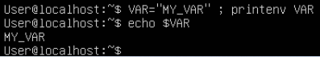
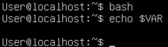
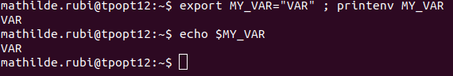
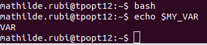
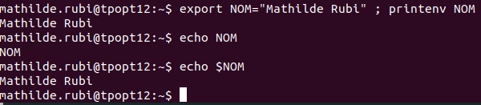
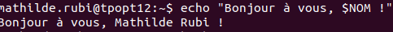
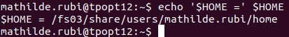
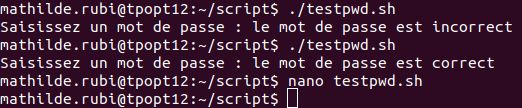
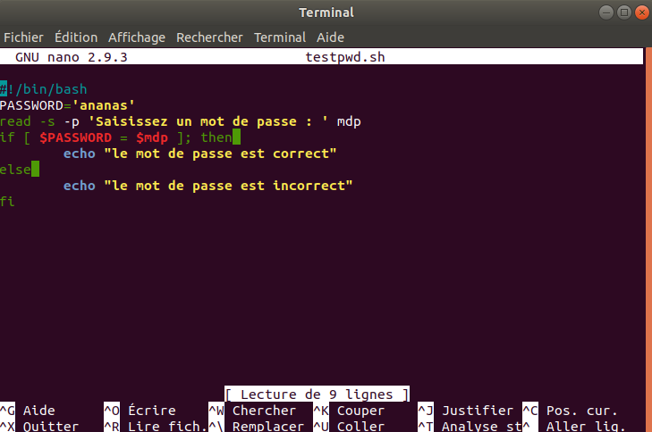

# Compte-rendu TP 2
*Mathilde Rubi*

## Exercice 1. Variable d'environnement

1.  Les commandes tapées par l'utilisateur se trouvent dans les dossiers /snap/bin.

3. La variable LANG détermine la lanque que les logiciels utilisent pour commuiniquer avec les utilisateurs
La variable PWD indique le nom du répertoire courant
La variable OLDPWD indique le dernier répertoire visité par l'utilisateur connecté
La variable SHELL indique le chemin du shell de l'utilisateur défini dans /etc/passwd

4. 

La variable   MY_VAR existe, son contenu est bien affiché quand on echo $MY_VAR

5. 

La commande bash est une commande 
La variable $MY_VAR n'existe car la session pendant laquelle elle a été créée n'estplus en cours

6. 

La variable a été écrite dans le bash, elle existe donc toujours

7. 

8. 

9. La commande unset supprime totalement une variable et sa valeur, alors que donner une valeur vide à une variable d'environnement conserve la variable, qui a du coup une valeur vide.

10. 

# Programmation Bash

## Exercice 2

## Exercice 3

